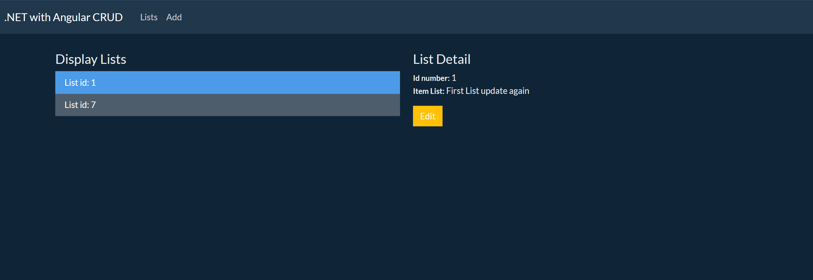
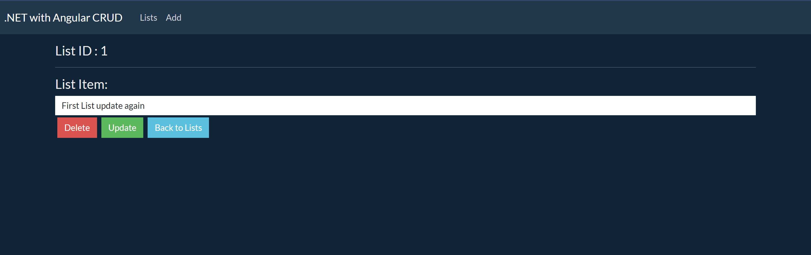
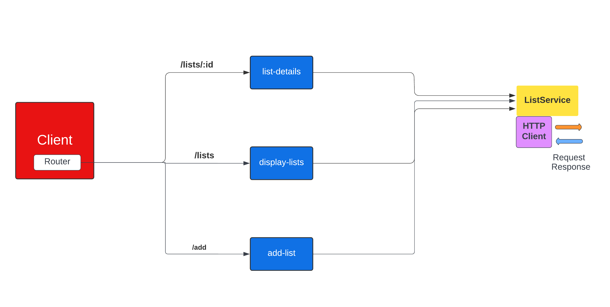

# .NET CRUD Application  

Basic web application using C# for backend and Angular for UI
with MS SQL for the database.





# Table of Contest

- [Table of Contest](#table-of-contest)

  - [Project Goal](#project-goal)

  - [Technologies Used](#technologies-used)

    - [Languages Used](#languages-used)

  - [Frameworks, Programmes, Database and Libraries](#frameworks-programmes-database-and-libraries)

  - [Testing](#testing)

  - [Project Initiation](#project-initiation)

    - [Create dotent app(Visiual Studio)](#create-dotnet-appvisiualstudio)

    - [Create GitHub repository](#create-github-repository)

  - [Database](#database)

    - [Database Setup](#database-setup)


  - [UI](#ui)

    - [App structure](#app-structure)

    - [Creating Angular App](#creating-angular-app)


## Project Goal

The assignment is to build a web application using the following technologies:

- Microsoft Visual Studio solution. :heavy_check_mark:
- UI in Angular. Backend in C#. :heavy_check_mark:
- SQL Server for persistence. :heavy_check_mark:
- Use raw SQL statements in the data access layer. :heavy_check_mark:
- App is demonstrated locally. Optionally on Azure. :heavy_check_mark:
  The assignment deliveries are:
- Git repository. Preferably private GitHub repository with shared access. Please share access only after when the assessment is complete. :heavy_check_mark:


## Technologies Used

### Languages Used

* [HTML5](https://en.wikipedia.org/wiki/HTML5)

* [CSS3](https://en.wikipedia.org/wiki/CSS)
* [TypeScript](https://en.wikipedia.org/wiki/TypeScript)
* [C#](https://docs.microsoft.com/en-us/dotnet/csharp)

## Frameworks, Programmes, Database and Libraries


* [Visiual Studio](https://visualstudio.microsoft.com/vs) - used for Backend.
* [Visual Studio Code](https://code.visualstudio.com) - used work with Angular.
* [Microsoft SQL Server](https://www.microsoft.com/en-us/sql-server/sql-server-downloads) - for database used in the project.
* [Chrome Developer Tools](https://developers.google.com/web/tools/chrome-devtools) - used to debug the application.

* [Lucidchart](https://www.lucidchart.com/) - used to create Angular client app structure.

* [Github](https://github.com/) - Github as the hosting site was used to store the source code of this website.

* [Git](https://git-scm.com/) - used Git to commit and push code to the GitHub repository.

* [Angular 13](https://angular.io/) - to built UI

* [.NET 6](https://dotnet.microsoft.com/en-us/) - framework used to develop this application

* [Bootstrap 5](https://getbootstrap.com) - used for layouts, styling and custom components
* [Bootswatch](https://bootswatch.com) - used ready Theme for Bootstrap


## Testing 

1. To test API I've used built-in Swagger.


Comments: GET, POST, PUT, DELETE List tested.

1. UI test:

  - app displaying Lists. - Pass

  - selecting individual list and displaying details. - Pass

  -`update` button redirecting to lists/:{id}. - Pass

  - `update` listItem with toastr notification displaying - Pass

  - `delete` list with toastr notification displaying - Pass

    - checking in SQL managment studio if DB updated. - Pass

  - `Back to Lists` button - Pass

  - navbar links tested - Pass

  

## Project Initiation


### Create dotent app(Visual Studio)

1. In Visual Studio `Create a new project`

2. Select : `ASP .NET Core Web API`

3. Choose the name of the project and location.  

5. Select framework and press `Create`. 

### Create GitHub repository

1. In Visual Studio in the newly created project press `Git` in the menu.

2. Next: `Create a Git repository`

3. Select the local path, Github account and repository name.
4. Press `Create and Push`

## Database

### Database Setup

1. In Visiual Studio in solution explorer go to dependncies and install 3 Nuget packages:

* Microsoft.EntityFrmaeworkCore
* Microsoft.EntityFrmaeworkCore.SqlServer
* Microsoft.EntityFrmaeworkCore.Tools 

1. Define DB model class in Model folder List.cs
2. Define DbContext class in Data folder.
3. In Program.cs we need to add service: `builder.Services.AddDbContext<DataContext>(options =>
    options.UseSqlServer(builder.Configuration.GetConnectionString("DevConnection")));`

4. In appsettings we ned to add the connection string : 
```
  "ConnectionStrings": {
    "DevConnection": "Server=localhost;Database=ListsDB;Trusted_Connection=True;MultipleActiveResultSets=True;"
  },
```
6. And then run migrations kin Package Manager Console: 
```
  Add-Migration "InitialCreate"
  Update-Database
```

## UI

### App structure





### Creating Angular App

1. In the VS Code we need first to clone the repository.
2. In the terminal we run `ng new Client --strict false`

3. Would you like to add Angular routing? Type: `Yes`

4. Which stylesheet format would you like to use? select: `CSS`

5. Once the app is created run in the client folder `ng serve` to test the application.

7. Create a service to communicate with api in vs code terminal `ng c service service/list `.

8. Create components needed in the project by running `ng g c components/add-list -s --skipTest `, `ng g c components/display-list -s --skipTest ` and `ng g c components/list-details -s --skipTest `.

9. To create an angular model, in the terminal run: `ng g class models/list --type=model`.


